# Gold Layer Design Prompt

## 🚀 Quick Start (2 hours)

**Goal:** Design complete Gold layer schema with ERD, YAML files, and documentation

**What You'll Create:**
1. **Mermaid ERD** - Visual diagram of all dimensions, facts, and relationships
2. **YAML Schema Files** - One per table with PRIMARY KEY, FOREIGN KEYs, columns, descriptions
3. **Documentation** - Dual-purpose (business + technical) table/column comments
4. **Design Review** - Stakeholder approval before implementation

**Fast Track:**
```markdown
## Deliverables Checklist:
- [ ] gold_layer_design/erd_complete.md - Mermaid diagram
- [ ] gold_layer_design/yaml/dim_*.yaml - Dimension schemas with lineage (2-5 files)
- [ ] gold_layer_design/yaml/fact_*.yaml - Fact schemas with lineage (2-4 files)
- [ ] gold_layer_design/COLUMN_LINEAGE.md - Bronze → Silver → Gold mapping (generated)
- [ ] gold_layer_design/DESIGN_SUMMARY.md - Grain + SCD + transformation decisions
```

**Key Design Decisions:**
- **Grain:** One row per _what_? (Must be explicit for each fact)
- **SCD Type:** Type 1 (overwrite) or Type 2 (history tracking) per dimension
- **Relationships:** Which FKs link facts to dimensions?
- **Measures:** Pre-aggregated (daily sales) vs transactional (line items)

**YAML = Single Source of Truth:**
- All column names, types, constraints, descriptions in YAML
- Implementation reads YAML (no manual DDL)
- Schema changes = YAML edits only

**Output:** Complete schema design ready for `03b-gold-layer-implementation-prompt.md`

📖 **Full guide below** for detailed design process →

---

## Quick Reference

**Use this prompt to design the Gold layer schema and documentation BEFORE implementation.**

---

## 📋 Your Requirements (Fill These In First)

### Project Context
- **Project Name:** _________________ (e.g., retail_analytics, patient_outcomes)
- **Silver Schema:** _________________ (e.g., my_project_silver)
- **Gold Schema:** _________________ (e.g., my_project_gold)
- **Business Domain:** _________________ (e.g., retail, healthcare, finance)

### Design Goals
- **Primary Use Cases:** _________________ (e.g., sales reporting, inventory analysis)
- **Key Stakeholders:** _________________ (e.g., Sales Operations, Finance Team)
- **Reporting Frequency:** _________________ (e.g., Daily, Weekly, Monthly)

---

## Core Philosophy: Design First, Code Later

**⚠️ CRITICAL PRINCIPLE:**

Gold layer design must be **documented and approved** before implementation:

- ✅ **Complete ERD** with all dimensions, facts, and relationships
- ✅ **YAML schema files** as single source of truth
- ✅ **Documented grain** for each fact table
- ✅ **SCD strategy** for each dimension
- ✅ **Dual-purpose documentation** (business + technical)
- ✅ **Stakeholder review** and approval

**Why This Matters:**
- Gold layer is the **business contract** for analytics
- Schema changes are expensive after deployment
- Documentation enables self-service analytics
- Clear grain prevents incorrect aggregations

---

## Step 1: Dimensional Model Design

### 1.1 Identify Dimensions (2-5 tables)

| # | Dimension Name | Business Key | SCD Type | Source Silver Table | Contains PII |
|---|---------------|--------------|----------|---------------------|--------------|
| 1 | dim_customer | customer_id | Type 2 | silver_customer_dim | Yes |
| 2 | dim_product | product_id | Type 1 | silver_product_dim | No |
| 3 | dim_date | date | Type 1 | Generated | No |
| 4 | dim_store | store_number | Type 2 | silver_store_dim | Yes |
| 5 | ____________ | ___________ | ______ | _________________ | _____ |

**SCD Type Decision Matrix:**

| SCD Type | When to Use | Examples |
|---|---|---|
| **Type 1 (Overwrite)** | History doesn't matter, attributes rarely change | Date dimensions, simple lookups, product categories |
| **Type 2 (Track History)** | Need to track changes over time for point-in-time analysis | Customer addresses, product prices, store status |

**SCD Type 2 Requirements:**
- Surrogate key (e.g., `store_key` as MD5 hash)
- Business key (e.g., `store_number`)
- `effective_from` TIMESTAMP
- `effective_to` TIMESTAMP (NULL for current)
- `is_current` BOOLEAN

### 1.2 Identify Facts (1-3 tables)

| # | Fact Name | Grain | Source Silver Tables | Update Frequency |
|---|-----------|-------|---------------------|------------------|
| 1 | fact_sales_daily | store-product-day | silver_transactions | Daily |
| 2 | fact_inventory_snapshot | store-product-day | silver_inventory | Daily |
| 3 | _____________ | _________________ | ___________________ | ________ |

**Grain Definition** (One row per...):
- **Store-Product-Day:** One row for each store-product combination per day
- **Customer-Month:** One row for each customer per month
- **Patient-Encounter:** One row per patient visit
- **Transaction:** One row per individual transaction (not aggregated)

**Grain Types:**
- **Aggregated:** Pre-summarized (daily_sales, weekly_revenue)
- **Transaction:** Individual events (query_execution, api_request)
- **Snapshot:** Point-in-time state (inventory_snapshot, account_balance)

**See [24-fact-table-grain-validation.mdc](mdc:.cursor/rules/24-fact-table-grain-validation.mdc) for grain validation patterns.**

### 1.3 Define Measures & Metrics

For each fact table:

| Fact Table | Measure Name | Data Type | Calculation Logic | Business Purpose |
|---|---|---|---|---|
| fact_sales_daily | gross_revenue | DECIMAL(18,2) | SUM(CASE WHEN qty > 0 THEN revenue END) | Revenue before returns |
| fact_sales_daily | net_revenue | DECIMAL(18,2) | SUM(revenue) | Revenue after returns (primary KPI) |
| fact_sales_daily | net_units | BIGINT | SUM(quantity) | Units sold after returns |
| fact_sales_daily | transaction_count | BIGINT | COUNT(DISTINCT transaction_id) | Number of transactions |
| fact_sales_daily | avg_transaction_value | DECIMAL(18,2) | net_revenue / transaction_count | Basket size metric |

**Measure Type Guidelines:**
- **Revenue/Amount:** DECIMAL(18,2) for monetary values
- **Quantities:** BIGINT for unit counts
- **Counts:** BIGINT for transaction/customer counts
- **Averages:** DECIMAL(18,2) calculated from other measures
- **Rates/Percentages:** DECIMAL(5,2) for percentages (e.g., 45.32%)

### 1.4 Define Relationships (FK Constraints)

| Fact Table | Dimension | FK Column | PK Column | Relationship |
|---|---|---|---|---|
| fact_sales_daily | dim_store | store_number | store_number | Many-to-One |
| fact_sales_daily | dim_product | upc_code | upc_code | Many-to-One |
| fact_sales_daily | dim_date | transaction_date | date | Many-to-One |

**Relationship Rules:**
- Facts → Dimensions: Always Many-to-One
- Use business keys for FK references (not surrogate keys)
- Document all FK constraints in DDL
- Use `NOT ENFORCED` (informational only)

---

## Step 2: Create ERD with Mermaid

### 2.1 Standard ERD Pattern

```mermaid
erDiagram
    dim_store ||--o{ fact_sales_daily : "store_number"
    dim_product ||--o{ fact_sales_daily : "upc_code"
    dim_date ||--o{ fact_sales_daily : "transaction_date"
    
    dim_store {
        string store_key PK "Surrogate key (SCD Type 2)"
        string store_number UK "Business key"
        string store_name
        string city
        string state
        timestamp effective_from
        timestamp effective_to
        boolean is_current "SCD Type 2 flag"
    }
    
    dim_product {
        string product_key PK "Surrogate key"
        string upc_code UK "Business key"
        string product_description
        string brand
        string category
    }
    
    dim_date {
        date date PK "Calendar date"
        int year
        int quarter
        int month
        string month_name
        int week_of_year
        boolean is_weekend
    }
    
    fact_sales_daily {
        string store_number FK "→ dim_store"
        string upc_code FK "→ dim_product"
        date transaction_date FK "→ dim_date"
        decimal gross_revenue "Before returns"
        decimal net_revenue "After returns"
        bigint net_units "After returns"
        bigint transaction_count
        decimal avg_transaction_value
    }
```



**ERD Requirements:**
- ✅ Show all dimensions and facts
- ✅ Show all relationships with cardinality
- ✅ Show primary keys (PK)
- ✅ Show foreign keys (FK)
- ✅ Show unique keys (UK) for business keys
- ✅ Add brief comments for key columns

**See [13-mermaid-erd-patterns.mdc](mdc:.cursor/rules/13-mermaid-erd-patterns.mdc) for complete ERD patterns.**

---

## Step 3: Create YAML Schema Files

### 3.1 YAML Directory Structure

```
gold_layer_design/
└── yaml/
    ├── {domain}/
    │   ├── dim_store.yaml
    │   ├── dim_product.yaml
    │   ├── dim_date.yaml
    │   └── fact_sales_daily.yaml
    └── README.md
```

### 3.2 Dimension YAML Template (SCD Type 2)

**File: `gold_layer_design/yaml/{domain}/dim_store.yaml`**

```yaml
# Table metadata
table_name: dim_store
domain: retail
bronze_source: retail.stores

# Table description (dual-purpose: business + technical)
description: >
  Gold layer conformed store dimension with SCD Type 2 history tracking.
  Business: Maintains complete store lifecycle history including address changes, 
  status updates, and operational attributes. Each store version tracked separately 
  for point-in-time analysis. Used for geographic analysis, territory management, 
  and historical performance comparisons.
  Technical: Slowly Changing Dimension Type 2 implementation with effective dating.
  Surrogate keys enable proper fact table joins to historical store states.
  Updates via Delta MERGE from Silver streaming tables.

# Grain definition
grain: "One row per store_number per version (SCD Type 2)"

# SCD strategy
scd_type: 2

# Primary key definition
primary_key:
  columns: ['store_key']
  composite: false

# Business key (unique constraint)
business_key:
  columns: ['store_number']
  
# Foreign key definitions (applied separately)
foreign_keys: []

# Column definitions
columns:
  # Surrogate Key
  - name: store_key
    type: STRING
    nullable: false
    description: >
      Surrogate key uniquely identifying each version of a store record.
      Business: Used for joining fact tables to dimension.
      Technical: MD5 hash generated from store_id and processed_timestamp 
      to ensure uniqueness across SCD Type 2 versions.
  
  # Business Key
  - name: store_number
    type: STRING
    nullable: false
    description: >
      Business key identifying the physical store location.
      Business: The primary identifier used by store operations and field teams.
      Technical: Natural key from source system, same across all historical versions of this store.
  
  # Attributes
  - name: store_name
    type: STRING
    nullable: true
    description: >
      Official name of the retail store location.
      Business: Used for customer-facing communications and internal reporting.
      Technical: Free-text field from POS system, may change over time.
  
  - name: city
    type: STRING
    nullable: true
    description: >
      City name where the store is located.
      Business: Used for geographic analysis and territory management.
      Technical: Standardized city name from address validation.
  
  - name: state
    type: STRING
    nullable: true
    description: >
      Two-letter US state code.
      Business: Used for state-level sales analysis and compliance reporting.
      Technical: Validated against standard US state abbreviations (CA, TX, NY, etc.).
  
  # SCD Type 2 Columns
  - name: effective_from
    type: TIMESTAMP
    nullable: false
    description: >
      Start timestamp for this version of the store record.
      Business: Indicates when this set of store attributes became active.
      Technical: SCD Type 2 field, populated from processed_timestamp when new version created.
  
  - name: effective_to
    type: TIMESTAMP
    nullable: true
    description: >
      End timestamp for this version of the store record.
      Business: NULL indicates this is the current version. Non-NULL indicates historical record.
      Technical: SCD Type 2 field, set to next version effective_from when superseded.
  
  - name: is_current
    type: BOOLEAN
    nullable: false
    description: >
      Flag indicating if this is the current active version.
      Business: TRUE for current store attributes, FALSE for historical records. 
      Use with WHERE is_current = true to get latest state.
      Technical: SCD Type 2 flag, updated to FALSE when new version created.
  
  # Audit Columns
  - name: record_created_timestamp
    type: TIMESTAMP
    nullable: false
    description: >
      Timestamp when this record was first inserted into the Gold layer.
      Business: Audit field for data lineage and troubleshooting.
      Technical: Set once at INSERT time, never updated.
  
  - name: record_updated_timestamp
    type: TIMESTAMP
    nullable: false
    description: >
      Timestamp when this record was last modified.
      Business: Audit field showing data freshness and update history.
      Technical: Updated on every MERGE operation that modifies the record.

# Table properties
table_properties:
  contains_pii: true
  data_classification: confidential
  business_owner: Retail Operations
  technical_owner: Data Engineering
  update_frequency: Daily
```

### 3.3 Fact Table YAML Template

**File: `gold_layer_design/yaml/{domain}/fact_sales_daily.yaml`**

```yaml
# Table metadata
table_name: fact_sales_daily
domain: sales
bronze_source: sales.transactions

# Table description
description: >
  Gold layer daily sales fact table with pre-aggregated metrics at store-product-day grain.
  Business: Primary source for sales performance reporting including revenue, units, 
  discounts, returns, and customer loyalty metrics. Aggregated from transaction-level 
  Silver data for fast query performance. Used for dashboards, executive reporting, 
  and sales analysis.
  Technical: Grain is one row per store-product-date combination. Pre-aggregated measures 
  eliminate need for transaction-level scans, surrogate keys enable fast dimension joins.

# Grain definition
grain: "One row per store_number-upc_code-transaction_date combination (daily aggregate)"

# Primary key definition (composite grain)
primary_key:
  columns: ['store_number', 'upc_code', 'transaction_date']
  composite: true

# Foreign key definitions
foreign_keys:
  - columns: ['store_number']
    references: dim_store(store_number)
    nullable: false
  - columns: ['upc_code']
    references: dim_product(upc_code)
    nullable: false
  - columns: ['transaction_date']
    references: dim_date(date)
    nullable: false

# Column definitions
columns:
  # Foreign Keys
  - name: store_number
    type: STRING
    nullable: false
    description: >
      Store identifier.
      Business: Links to store dimension for location-based analysis.
      Technical: FK to dim_store.store_number (business key for query simplicity).
    lineage:
      bronze_table: bronze_transactions
      bronze_column: store_number
      silver_table: silver_transactions
      silver_column: store_number
      transformation: "DIRECT_COPY"  # No transformation, direct column copy
  
  - name: upc_code
    type: STRING
    nullable: false
    description: >
      Product UPC code.
      Business: Links to product dimension for product analysis.
      Technical: FK to dim_product.upc_code (business key).
  
  - name: transaction_date
    type: DATE
    nullable: false
    description: >
      Transaction date.
      Business: Date dimension for time-based analysis and trending.
      Technical: FK to dim_date.date.
  
  # Revenue Measures
  - name: gross_revenue
    type: DECIMAL(18,2)
    nullable: true
    description: >
      Total revenue before returns.
      Business: Gross sales amount, primary revenue indicator before adjustments.
      Technical: SUM(CASE WHEN quantity > 0 THEN revenue ELSE 0 END) from Silver transactions.
    lineage:
      bronze_table: bronze_transactions
      bronze_column: final_sales_price
      silver_table: silver_transactions
      silver_column: final_sales_price
      transformation: "AGGREGATE_SUM_CONDITIONAL"  # SUM(CASE WHEN quantity_sold > 0 THEN final_sales_price ELSE 0 END)
      aggregation_logic: "SUM(CASE WHEN quantity_sold > 0 THEN final_sales_price ELSE 0 END)"
      groupby_columns: ['store_number', 'upc_code', 'transaction_date']
  
  - name: net_revenue
    type: DECIMAL(18,2)
    nullable: true
    description: >
      Net revenue after subtracting returns.
      Business: The actual revenue realized from sales, primary KPI for financial reporting.
      Technical: SUM(revenue) from Silver (includes negative values for returns).
  
  # Unit Measures
  - name: net_units
    type: BIGINT
    nullable: true
    description: >
      Net units sold after returns.
      Business: Actual quantity sold, used for inventory planning and demand forecasting.
      Technical: SUM(quantity) from Silver (includes negative values for returns).
  
  # Transaction Counts
  - name: transaction_count
    type: BIGINT
    nullable: true
    description: >
      Number of transactions.
      Business: Volume of customer interactions, used for store performance and staffing.
      Technical: COUNT(DISTINCT transaction_id) from Silver.
  
  # Derived Metrics
  - name: avg_transaction_value
    type: DECIMAL(18,2)
    nullable: true
    description: >
      Average dollar value per transaction.
      Business: Basket size indicator for pricing and promotion strategies.
      Technical: net_revenue / transaction_count.
  
  # Audit Columns
  - name: record_created_timestamp
    type: TIMESTAMP
    nullable: false
    description: >
      Timestamp when this daily aggregate was first created.
      Business: Audit field for data lineage and pipeline troubleshooting.
      Technical: Set during initial MERGE INSERT, remains constant.
  
  - name: record_updated_timestamp
    type: TIMESTAMP
    nullable: false
    description: >
      Timestamp when this daily aggregate was last refreshed.
      Business: Shows data freshness for this date, useful for validating 
      late-arriving transactions were included.
      Technical: Updated on every MERGE operation that touches this record.

# Table properties
table_properties:
  contains_pii: false
  data_classification: internal
  business_owner: Sales Operations
  technical_owner: Data Engineering
  update_frequency: Daily
  aggregation_level: daily
```

### 3.4 Date Dimension YAML Template

**File: `gold_layer_design/yaml/time/dim_date.yaml`**

```yaml
# Table metadata
table_name: dim_date
domain: time
bronze_source: generated

description: >
  Gold layer date dimension with calendar attributes.
  Business: Standard date dimension for time-based analysis, trending, and reporting 
  across all fact tables. Supports fiscal year, holiday tracking, and weekday analysis.
  Technical: Populated for date range covering historical data plus future dates 
  for forecasting. Not sourced from Silver, generated internally.

grain: "One row per calendar date"

scd_type: 1

primary_key:
  columns: ['date']
  composite: false

foreign_keys: []

columns:
  - name: date
    type: DATE
    nullable: false
    description: >
      Calendar date.
      Business: The date dimension for all time-based analysis.
      Technical: Primary key for date dimension, no surrogate key needed.
  
  - name: year
    type: INT
    nullable: false
    description: >
      Calendar year (YYYY).
      Business: Year for annual analysis and YoY comparisons.
      Technical: YEAR(date).
  
  - name: quarter
    type: INT
    nullable: false
    description: >
      Calendar quarter (1-4).
      Business: Quarter for quarterly reporting and seasonality analysis.
      Technical: QUARTER(date).
  
  - name: month
    type: INT
    nullable: false
    description: >
      Calendar month (1-12).
      Business: Month for monthly trends and MoM comparisons.
      Technical: MONTH(date).
  
  - name: month_name
    type: STRING
    nullable: false
    description: >
      Month name (January, February, etc.).
      Business: User-friendly month labels for reports and dashboards.
      Technical: DATE_FORMAT(date, 'MMMM').
  
  - name: week_of_year
    type: INT
    nullable: false
    description: >
      ISO week of year (1-53).
      Business: Week-level analysis for short-term trends.
      Technical: WEEKOFYEAR(date).
  
  - name: day_of_week
    type: INT
    nullable: false
    description: >
      Day of week (1=Sunday, 7=Saturday).
      Business: Day-of-week analysis for staffing and promotions.
      Technical: DAYOFWEEK(date).
  
  - name: day_of_week_name
    type: STRING
    nullable: false
    description: >
      Day name (Monday, Tuesday, etc.).
      Business: User-friendly day labels.
      Technical: DATE_FORMAT(date, 'EEEE').
  
  - name: is_weekend
    type: BOOLEAN
    nullable: false
    description: >
      Weekend indicator.
      Business: Weekend vs weekday analysis for traffic patterns.
      Technical: day_of_week IN (1, 7).
  
  - name: is_holiday
    type: BOOLEAN
    nullable: true
    description: >
      Holiday indicator.
      Business: Holiday impact on sales and staffing.
      Technical: Populated from holiday calendar lookup.

table_properties:
  contains_pii: false
  data_classification: public
  business_owner: Enterprise Data
  technical_owner: Data Engineering
  update_frequency: Static
```

**See [25-yaml-driven-gold-setup.mdc](mdc:.cursor/rules/25-yaml-driven-gold-setup.mdc) for YAML-driven implementation patterns.**

---

## Step 4: Documentation Standards

### 4.1 Dual-Purpose Column Descriptions

**Every column description must serve both business and technical audiences:**

**Pattern:**
```
[Natural description]. Business: [business context and use cases]. Technical: [implementation details].
```

**Examples:**

```yaml
# Surrogate Key
store_key STRING NOT NULL
  description: >
    Surrogate key uniquely identifying each version of a store record.
    Business: Used for joining fact tables to dimension.
    Technical: MD5 hash generated from store_id and processed_timestamp 
    to ensure uniqueness across SCD Type 2 versions.

# Measure
net_revenue DECIMAL(18,2)
  description: >
    Net revenue after subtracting returns from gross revenue.
    Business: The actual revenue realized from sales, primary KPI for financial reporting.
    Technical: gross_revenue - return_amount, represents true daily sales value.

# Boolean Flag
is_current BOOLEAN
  description: >
    Flag indicating if this is the current active version.
    Business: TRUE for current store attributes, FALSE for historical records. 
    Use with WHERE is_current = true to get latest state.
    Technical: SCD Type 2 flag, updated to FALSE when new version created.
```

**Documentation Requirements:**
- ✅ Opening sentence: Clear, natural language definition
- ✅ Business section: Purpose, use cases, business rules
- ✅ Technical section: Data type, calculation, source, constraints
- ❌ No "LLM:" prefix (use natural dual-purpose format)

**See [12-gold-layer-documentation.mdc](mdc:.cursor/rules/12-gold-layer-documentation.mdc) for complete documentation standards.**

### 4.2 Table Description Standards

**Table descriptions must include:**
1. Layer and purpose
2. Grain (what one row represents)
3. Business use cases
4. Technical implementation

**Example:**
```yaml
description: >
  Gold layer daily sales fact table with pre-aggregated metrics at store-product-day grain.
  Business: Primary source for sales performance reporting including revenue, units, 
  discounts, returns, and customer loyalty metrics. Aggregated from transaction-level 
  Silver data for fast query performance. Used for dashboards, executive reporting, 
  and sales analysis.
  Technical: Grain is one row per store-product-date combination. Pre-aggregated measures 
  eliminate need for transaction-level scans, surrogate keys enable fast dimension joins.
```

---

## Step 4: Column-Level Lineage & Transformation Documentation

### 4.1 Why Lineage Documentation Matters

**Problem:** Schema mismatches cause 33% of Gold layer bugs during implementation
- Column names differ between Bronze, Silver, and Gold
- Transformations are implicit (not documented)
- Manual column mapping prone to errors
- Hard to trace data from source to target

**Solution:** Explicit lineage documentation in YAML for every column

**Benefits:**
- ✅ **Prevents schema mismatches** - Explicit Bronze → Silver → Gold mapping
- ✅ **Documents transformations** - Clear logic for each column
- ✅ **Generates merge scripts** - Can auto-generate column mappings
- ✅ **Audit trail** - Complete data lineage from source
- ✅ **Onboarding** - New developers understand data flow

### 4.2 Lineage Schema in YAML

**Add `lineage` section to EVERY column definition:**

```yaml
columns:
  - name: {gold_column_name}
    type: {DATA_TYPE}
    nullable: {true|false}
    description: >
      {Dual-purpose description}
    lineage:
      bronze_table: {bronze_table_name}
      bronze_column: {bronze_column_name}
      silver_table: {silver_table_name}
      silver_column: {silver_column_name}
      transformation: "{TRANSFORMATION_TYPE}"
      transformation_logic: "{Explicit SQL/PySpark expression}"
      notes: "{Any special considerations}"
```

### 4.3 Standard Transformation Types

**Use these standard transformation type codes:**

| Transformation Type | Description | Example | Implementation |
|---|---|---|---|
| `DIRECT_COPY` | No transformation, direct column copy | store_number | `col("store_number")` |
| `RENAME` | Column renamed, no value change | company_rcn → company_retail_control_number | `.withColumn("company_retail_control_number", col("company_rcn"))` |
| `CAST` | Data type conversion | STRING → INT, DATE → TIMESTAMP | `.withColumn("column", col("column").cast("int"))` |
| `AGGREGATE_SUM` | Simple SUM aggregation | SUM(revenue) | `spark_sum("revenue")` |
| `AGGREGATE_SUM_CONDITIONAL` | Conditional SUM | SUM(CASE WHEN qty > 0 THEN revenue END) | `spark_sum(when(col("qty") > 0, col("revenue")).otherwise(0))` |
| `AGGREGATE_COUNT` | COUNT aggregation | COUNT(*) or COUNT(DISTINCT id) | `count("*")` or `countDistinct("id")` |
| `AGGREGATE_AVG` | AVG aggregation | AVG(price) | `avg("price")` |
| `DERIVED_CALCULATION` | Calculated from other Gold columns | avg_value = total / count | Calculated within Gold MERGE |
| `DERIVED_CONDITIONAL` | Conditional logic (CASE/when) | CASE WHEN qty > 0 THEN 'Sale' ELSE 'Return' | `when(col("qty") > 0, "Sale").otherwise("Return")` |
| `HASH_MD5` | MD5 hash for surrogate keys | MD5(store_id \|\| timestamp) | `md5(concat_ws("\|\|", col("store_id"), col("timestamp")))` |
| `HASH_SHA256` | SHA256 hash for business keys | SHA256(keys) | `sha2(concat_ws("\|\|", col("key1"), col("key2")), 256)` |
| `COALESCE` | Null handling with default | COALESCE(discount, 0) | `coalesce(col("discount"), lit(0))` |
| `DATE_TRUNC` | Date truncation | DATE_TRUNC('day', timestamp) | `date_trunc("day", col("timestamp")).cast("date")` |
| `GENERATED` | Not from source, generated in Gold | CURRENT_TIMESTAMP() | `current_timestamp()` |
| `LOOKUP` | Value from dimension join | Get city from dim_store | Join in MERGE script |

### 4.4 Complete Column Lineage Examples

**Example 1: Direct Copy (FK)**
```yaml
- name: store_number
  type: STRING
  nullable: false
  description: >
    Store identifier.
    Business: Links to store dimension for location-based analysis.
    Technical: FK to dim_store.store_number (business key).
  lineage:
    bronze_table: bronze_transactions
    bronze_column: store_number
    silver_table: silver_transactions
    silver_column: store_number
    transformation: "DIRECT_COPY"
    transformation_logic: "col('store_number')"
```

**Example 2: Renamed Column**
```yaml
- name: company_retail_control_number
  type: STRING
  nullable: true
  description: >
    Company retail control number for corporate hierarchy.
    Business: Links store to corporate entity for multi-company rollups.
    Technical: Renamed from company_rcn for clarity.
  lineage:
    bronze_table: bronze_store_dim
    bronze_column: company_rcn
    silver_table: silver_store_dim
    silver_column: company_rcn
    transformation: "RENAME"
    transformation_logic: ".withColumn('company_retail_control_number', col('company_rcn'))"
    notes: "Column renamed in Gold for business clarity"
```

**Example 3: Conditional Aggregation**
```yaml
- name: gross_revenue
  type: DECIMAL(18,2)
  nullable: false
  description: >
    Total revenue before returns (positive sales only).
    Business: Gross sales amount before return adjustments.
    Technical: SUM of positive transaction amounts only.
  lineage:
    bronze_table: bronze_transactions
    bronze_column: final_sales_price
    silver_table: silver_transactions
    silver_column: final_sales_price
    transformation: "AGGREGATE_SUM_CONDITIONAL"
    transformation_logic: "spark_sum(when(col('quantity_sold') > 0, col('final_sales_price')).otherwise(0))"
    groupby_columns: ['store_number', 'upc_code', 'transaction_date']
    aggregation_level: "daily"
```

**Example 4: Derived Calculation**
```yaml
- name: avg_transaction_value
  type: DECIMAL(18,2)
  nullable: false
  description: >
    Average dollar value per transaction.
    Business: Basket size metric for pricing strategies.
    Technical: net_revenue / transaction_count.
  lineage:
    bronze_table: N/A
    bronze_column: N/A
    silver_table: N/A
    silver_column: N/A
    transformation: "DERIVED_CALCULATION"
    transformation_logic: "col('net_revenue') / col('transaction_count')"
    depends_on: ['net_revenue', 'transaction_count']
    notes: "Calculated from other Gold columns"
```

**Example 5: Surrogate Key (SCD Type 2)**
```yaml
- name: store_key
  type: STRING
  nullable: false
  description: >
    Surrogate key for this store version.
    Business: Used for fact table joins to historical store states.
    Technical: MD5 hash of store_number + processed_timestamp.
  lineage:
    bronze_table: bronze_store_dim
    bronze_column: store_id, processed_timestamp
    silver_table: silver_store_dim
    silver_column: store_id, processed_timestamp
    transformation: "HASH_MD5"
    transformation_logic: "md5(concat_ws('||', col('store_id'), col('processed_timestamp')))"
    notes: "Ensures uniqueness across SCD Type 2 versions"
```

**Example 6: Generated Audit Column**
```yaml
- name: record_created_timestamp
  type: TIMESTAMP
  nullable: false
  description: >
    Timestamp when record was created in Gold layer.
    Business: Audit field for data lineage.
    Technical: Set once at INSERT time, never updated.
  lineage:
    bronze_table: N/A
    bronze_column: N/A
    silver_table: N/A
    silver_column: N/A
    transformation: "GENERATED"
    transformation_logic: "current_timestamp()"
    notes: "Generated during Gold MERGE INSERT"
```

### 4.5 Lineage Documentation Requirements

**Every column MUST have:**
- ✅ `bronze_table` - Source Bronze table (or N/A if generated)
- ✅ `bronze_column` - Source Bronze column(s)
- ✅ `silver_table` - Intermediate Silver table (or N/A)
- ✅ `silver_column` - Silver column(s)
- ✅ `transformation` - Type from standard list above
- ✅ `transformation_logic` - Explicit SQL/PySpark expression
- ✅ `notes` - Optional special considerations

**For aggregations, ALSO add:**
- ✅ `aggregation_logic` - Complete aggregation expression
- ✅ `groupby_columns` - Grouping columns (defines grain)
- ✅ `aggregation_level` - Level description (daily, monthly, etc.)

**For derived columns, ALSO add:**
- ✅ `depends_on` - List of Gold columns used in calculation

---

## Step 5: Generate Column-Level Lineage Document

### 5.1 Lineage Document Purpose

**Create a comprehensive lineage document showing Bronze → Silver → Gold mapping for EVERY column.**

**File:** `gold_layer_design/COLUMN_LINEAGE.md`

**Benefits:**
- ✅ **Prevents schema mismatches** - See exact source columns before coding
- ✅ **Documents transformations** - Clear logic for each column
- ✅ **Code review aid** - Verify merge scripts match lineage
- ✅ **Troubleshooting** - Trace data issues back to source
- ✅ **Impact analysis** - Understand downstream effects of schema changes

### 5.2 Lineage Document Template

```markdown
# Column-Level Lineage: Bronze → Silver → Gold

**Generated:** {date}
**Project:** {project_name}
**Version:** {version}

## Purpose
This document provides complete column-level data lineage from Bronze through Gold layer,
including transformation logic for every column. Use this as reference when implementing
Gold merge scripts to prevent schema mismatches.

---

## Table: dim_store

**Grain:** One row per store_number per version (SCD Type 2)
**Bronze Source:** bronze_store_dim
**Silver Source:** silver_store_dim
**Gold Target:** dim_store

### Column Lineage

| Gold Column | Type | Bronze Source | Silver Source | Transformation | Logic | Notes |
|---|---|---|---|---|---|---|
| store_key | STRING | store_id, processed_timestamp | store_id, processed_timestamp | HASH_MD5 | `md5(concat_ws('||', col('store_id'), col('processed_timestamp')))` | Surrogate key for SCD2 |
| store_number | STRING | store_number | store_number | DIRECT_COPY | `col('store_number')` | Business key |
| store_name | STRING | store_name | store_name | DIRECT_COPY | `col('store_name')` | - |
| city | STRING | city | city | DIRECT_COPY | `col('city')` | - |
| state | STRING | state | state | DIRECT_COPY | `col('state')` | - |
| company_retail_control_number | STRING | company_rcn | company_rcn | RENAME | `.withColumn('company_retail_control_number', col('company_rcn'))` | Renamed for clarity |
| effective_from | TIMESTAMP | processed_timestamp | processed_timestamp | DIRECT_COPY | `col('processed_timestamp')` | SCD2 start date |
| effective_to | TIMESTAMP | N/A | N/A | GENERATED | `lit(None).cast('timestamp')` | SCD2 end date (NULL for current) |
| is_current | BOOLEAN | N/A | N/A | GENERATED | `lit(True)` | SCD2 current flag |
| record_created_timestamp | TIMESTAMP | N/A | N/A | GENERATED | `current_timestamp()` | Audit field |
| record_updated_timestamp | TIMESTAMP | N/A | N/A | GENERATED | `current_timestamp()` | Audit field |

---

## Table: fact_sales_daily

**Grain:** One row per store_number-upc_code-transaction_date (daily aggregate)
**Bronze Source:** bronze_transactions
**Silver Source:** silver_transactions
**Gold Target:** fact_sales_daily

### Column Lineage

| Gold Column | Type | Bronze Source | Silver Source | Transformation | Logic | Grouping |
|---|---|---|---|---|---|---|
| store_number | STRING | store_number | store_number | DIRECT_COPY | `col('store_number')` | Part of grain |
| upc_code | STRING | upc_code | upc_code | DIRECT_COPY | `col('upc_code')` | Part of grain |
| transaction_date | DATE | transaction_date | transaction_date | DIRECT_COPY | `col('transaction_date')` | Part of grain |
| gross_revenue | DECIMAL(18,2) | final_sales_price | final_sales_price | AGGREGATE_SUM_CONDITIONAL | `spark_sum(when(col('quantity_sold') > 0, col('final_sales_price')).otherwise(0))` | GROUP BY store, product, date |
| net_revenue | DECIMAL(18,2) | final_sales_price | final_sales_price | AGGREGATE_SUM | `spark_sum('final_sales_price')` | GROUP BY store, product, date |
| net_units | BIGINT | quantity_sold | quantity_sold | AGGREGATE_SUM | `spark_sum('quantity_sold')` | GROUP BY store, product, date |
| transaction_count | BIGINT | transaction_id | transaction_id | AGGREGATE_COUNT | `count('*')` | GROUP BY store, product, date |
| avg_transaction_value | DECIMAL(18,2) | N/A | N/A | DERIVED_CALCULATION | `col('net_revenue') / col('transaction_count')` | Calculated from Gold columns |
| record_created_timestamp | TIMESTAMP | N/A | N/A | GENERATED | `current_timestamp()` | Generated at INSERT |
| record_updated_timestamp | TIMESTAMP | N/A | N/A | GENERATED | `current_timestamp()` | Generated at MERGE |

### Transformation Summary

**Aggregation Grain:** GROUP BY (store_number, upc_code, transaction_date)

**Silver Query Pattern:**
```python
daily_sales = (
    silver_transactions
    .groupBy("store_number", "upc_code", "transaction_date")
    .agg(
        spark_sum(when(col("quantity_sold") > 0, col("final_sales_price")).otherwise(0)).alias("gross_revenue"),
        spark_sum("final_sales_price").alias("net_revenue"),
        spark_sum("quantity_sold").alias("net_units"),
        count("*").alias("transaction_count")
    )
    .withColumn("avg_transaction_value", col("net_revenue") / col("transaction_count"))
    .withColumn("record_created_timestamp", current_timestamp())
    .withColumn("record_updated_timestamp", current_timestamp())
)
```

**Column Mapping for MERGE:**
```python
# All columns map directly from daily_sales DataFrame
# NO renaming needed - column names match between Silver aggregation and Gold table
```
```

### 5.3 How to Generate Lineage Document

**Step 1: Extract from all YAML files**
```python
import yaml
from pathlib import Path

def generate_lineage_doc(yaml_dir: str, output_file: str):
    """Generate complete lineage documentation from YAML files."""
    
    lineage_md = ["# Column-Level Lineage: Bronze → Silver → Gold\n"]
    lineage_md.append(f"**Generated:** {datetime.now().strftime('%Y-%m-%d %H:%M')}\n")
    lineage_md.append("---\n\n")
    
    # Find all YAML files
    yaml_files = Path(yaml_dir).rglob("*.yaml")
    
    for yaml_file in sorted(yaml_files):
        with open(yaml_file, 'r') as f:
            config = yaml.safe_load(f)
        
        table_name = config['table_name']
        grain = config.get('grain', 'Not specified')
        
        lineage_md.append(f"## Table: {table_name}\n\n")
        lineage_md.append(f"**Grain:** {grain}\n")
        lineage_md.append(f"**Domain:** {config.get('domain', 'N/A')}\n\n")
        
        # Create lineage table
        lineage_md.append("| Gold Column | Type | Bronze Source | Silver Source | Transformation | Logic |\n")
        lineage_md.append("|---|---|---|---|---|---|\n")
        
        for col in config.get('columns', []):
            name = col['name']
            dtype = col['type']
            lineage = col.get('lineage', {})
            
            bronze_src = f"{lineage.get('bronze_table', 'N/A')}.{lineage.get('bronze_column', 'N/A')}"
            silver_src = f"{lineage.get('silver_table', 'N/A')}.{lineage.get('silver_column', 'N/A')}"
            trans_type = lineage.get('transformation', 'UNKNOWN')
            trans_logic = lineage.get('transformation_logic', 'Not documented')
            
            lineage_md.append(f"| {name} | {dtype} | {bronze_src} | {silver_src} | {trans_type} | `{trans_logic}` |\n")
        
        lineage_md.append("\n---\n\n")
    
    # Write to file
    with open(output_file, 'w') as f:
        f.write(''.join(lineage_md))
    
    print(f"✓ Generated lineage document: {output_file}")
```

**Step 2: Run generation script**
```bash
python scripts/generate_lineage_doc.py \
  --yaml-dir gold_layer_design/yaml \
  --output gold_layer_design/COLUMN_LINEAGE.md
```

**Step 3: Review before implementation**
Before writing any Gold merge script, review the lineage document to:
- ✅ Verify all Silver columns exist
- ✅ Understand transformation logic needed
- ✅ Identify renamed columns
- ✅ Plan aggregation queries
- ✅ Check for data type conversions

### 5.4 Using Lineage in Merge Scripts

**The lineage document prevents these common errors:**

❌ **ERROR 1: Column doesn't exist**
```python
# Merge script references non-existent column
.withColumn("company_retail_control_number", col("company_retail_control_number"))
# Error: Column 'company_retail_control_number' does not exist in Silver!
```

✅ **SOLUTION: Check lineage document**
```markdown
| company_retail_control_number | STRING | bronze_store_dim.company_rcn | silver_store_dim.company_rcn | RENAME | ...
```
```python
# Correct: Map from Silver name
.withColumn("company_retail_control_number", col("company_rcn"))
```

❌ **ERROR 2: Wrong transformation logic**
```python
# Missing conditional logic
.agg(spark_sum("final_sales_price").alias("gross_revenue"))
# Problem: Includes returns (negative values)!
```

✅ **SOLUTION: Check lineage document**
```markdown
| gross_revenue | DECIMAL(18,2) | ... | AGGREGATE_SUM_CONDITIONAL | spark_sum(when(col('quantity_sold') > 0, col('final_sales_price')).otherwise(0))
```
```python
# Correct: Use conditional SUM
.agg(spark_sum(when(col("quantity_sold") > 0, col("final_sales_price")).otherwise(0)).alias("gross_revenue"))
```

❌ **ERROR 3: Missing CAST**
```python
# DATE_TRUNC returns TIMESTAMP, but Gold expects DATE
.withColumn("check_in_date", date_trunc("day", col("check_in_timestamp")))
# Error: Schema mismatch (TIMESTAMP vs DATE)
```

✅ **SOLUTION: Check lineage document**
```markdown
| check_in_date | DATE | ... | DATE_TRUNC | date_trunc('day', col('check_in_timestamp')).cast('date')
```
```python
# Correct: Add CAST
.withColumn("check_in_date", date_trunc("day", col("check_in_timestamp")).cast("date"))
```

---

## Step 6: Documentation Standards

### 6.1 Dual-Purpose Column Descriptions

**Every column description must serve both business and technical audiences:**

**Pattern:**
```
[Natural description]. Business: [business context and use cases]. Technical: [implementation details].
```

**Examples:**

```yaml
# Surrogate Key
store_key STRING NOT NULL
  description: >
    Surrogate key uniquely identifying each version of a store record.
    Business: Used for joining fact tables to dimension.
    Technical: MD5 hash generated from store_id and processed_timestamp 
    to ensure uniqueness across SCD Type 2 versions.

# Measure
net_revenue DECIMAL(18,2)
  description: >
    Net revenue after subtracting returns from gross revenue.
    Business: The actual revenue realized from sales, primary KPI for financial reporting.
    Technical: gross_revenue - return_amount, represents true daily sales value.

# Boolean Flag
is_current BOOLEAN
  description: >
    Flag indicating if this is the current active version.
    Business: TRUE for current store attributes, FALSE for historical records. 
    Use with WHERE is_current = true to get latest state.
    Technical: SCD Type 2 flag, updated to FALSE when new version created.
```

**Documentation Requirements:**
- ✅ Opening sentence: Clear, natural language definition
- ✅ Business section: Purpose, use cases, business rules
- ✅ Technical section: Data type, calculation, source, constraints
- ❌ No "LLM:" prefix (use natural dual-purpose format)

**See [12-gold-layer-documentation.mdc](mdc:.cursor/rules/gold/12-gold-layer-documentation.mdc) for complete documentation standards.**

### 6.2 Table Description Standards

**Table descriptions must include:**
1. Layer and purpose
2. Grain (what one row represents)
3. Business use cases
4. Technical implementation

**Example:**
```yaml
description: >
  Gold layer daily sales fact table with pre-aggregated metrics at store-product-day grain.
  Business: Primary source for sales performance reporting including revenue, units, 
  discounts, returns, and customer loyalty metrics. Aggregated from transaction-level 
  Silver data for fast query performance. Used for dashboards, executive reporting, 
  and sales analysis.
  Technical: Grain is one row per store-product-date combination. Pre-aggregated measures 
  eliminate need for transaction-level scans, surrogate keys enable fast dimension joins.
```

---

## Design Validation Checklist

### Dimensional Model
- [ ] 2-5 dimensions identified
- [ ] 1-3 facts identified
- [ ] SCD type decided for each dimension
- [ ] Grain defined for each fact table
- [ ] All measures documented with calculation logic
- [ ] All relationships documented

### ERD
- [ ] Mermaid ERD created
- [ ] All dimensions shown
- [ ] All facts shown
- [ ] All relationships shown with cardinality
- [ ] Primary keys marked
- [ ] Foreign keys marked
- [ ] Brief comments on key columns

### YAML Schemas
- [ ] One YAML file per table
- [ ] Organized by domain
- [ ] Complete column definitions
- [ ] Primary key defined
- [ ] Foreign keys defined
- [ ] Dual-purpose descriptions (business + technical)
- [ ] Table properties documented
- [ ] Grain explicitly stated
- [ ] **Lineage documentation for EVERY column**
- [ ] **Transformation type specified** (from standard list)
- [ ] **Transformation logic documented** (explicit SQL/PySpark)

### Column-Level Lineage
- [ ] Bronze source table/column documented for every column
- [ ] Silver source table/column documented for every column
- [ ] Transformation type from standard list
- [ ] Transformation logic explicit and executable
- [ ] Aggregation columns specify groupby_columns
- [ ] Derived columns specify depends_on
- [ ] Generated columns marked as such

### Lineage Document
- [ ] COLUMN_LINEAGE.md generated from YAML files
- [ ] All tables included
- [ ] Complete Bronze → Silver → Gold mapping
- [ ] Transformation summary per table
- [ ] Sample query patterns provided
- [ ] Column mapping guidance included

### Documentation
- [ ] Every column has dual-purpose description
- [ ] No "LLM:" prefix used
- [ ] Business section explains purpose and use cases
- [ ] Technical section explains implementation
- [ ] SCD strategy documented
- [ ] Update frequency documented

### Stakeholder Review
- [ ] ERD reviewed with business stakeholders
- [ ] Grain validated for each fact
- [ ] Measures confirmed complete
- [ ] Naming conventions approved
- [ ] Data classification verified
- [ ] Design sign-off obtained

---

## Output Deliverables

After completing this design phase, you should have:

1. **ERD (Mermaid)** - Visual representation of dimensional model
2. **YAML Schema Files** - Complete schema definitions with lineage (one per table)
3. **Column Lineage Document** - Complete Bronze → Silver → Gold mapping for all columns
4. **Design Document** - Summary of design decisions and rationale
5. **Stakeholder Sign-off** - Approval from business owners

**Critical:** The COLUMN_LINEAGE.md document prevents 33% of schema mismatch bugs during implementation!

**Next Step:** Use [03b-gold-layer-implementation-prompt.md](./03b-gold-layer-implementation-prompt.md) to implement the design.

---

## References

### Official Documentation
- [Dimensional Modeling](https://www.kimballgroup.com/data-warehouse-business-intelligence-resources/kimball-techniques/dimensional-modeling-techniques/)
- [Unity Catalog Constraints](https://docs.databricks.com/data-governance/unity-catalog/constraints.html)

### Framework Rules
- [12-gold-layer-documentation.mdc](mdc:.cursor/rules/12-gold-layer-documentation.mdc) - Documentation standards
- [13-mermaid-erd-patterns.mdc](mdc:.cursor/rules/13-mermaid-erd-patterns.mdc) - ERD patterns
- [24-fact-table-grain-validation.mdc](mdc:.cursor/rules/24-fact-table-grain-validation.mdc) - Grain validation
- [25-yaml-driven-gold-setup.mdc](mdc:.cursor/rules/25-yaml-driven-gold-setup.mdc) - YAML patterns

---

## Summary

**What to Create:**
1. ERD with Mermaid diagram
2. YAML schema files with lineage (one per table)
3. Column-level lineage document (Bronze → Silver → Gold)
4. Design documentation
5. Stakeholder approval

**Core Philosophy:** Design = Business contract for analytics (document before implementing)

**New Requirement:** Column-level lineage prevents 33% of Gold merge bugs!

**Time Estimate:** 3-4 hours for 3-5 tables (includes lineage documentation)

**Next Action:** Complete design with lineage, get stakeholder sign-off, then proceed to implementation

