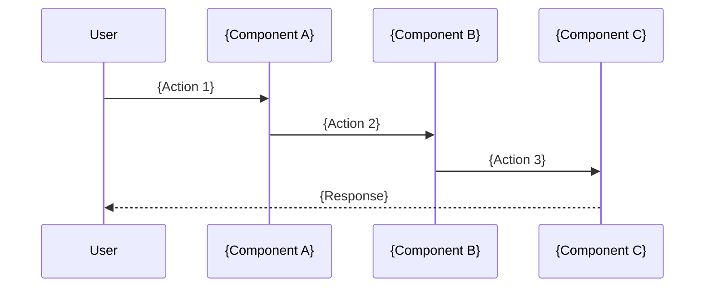

# Documentation Framework Generation Prompt

## Purpose

This prompt guides the creation of **comprehensive, professional documentation** for any technical framework, system, or use case. It ensures consistent structure, depth, and quality across all documentation deliverables.

---

## 📋 Your Requirements (Fill These In First)

### Documentation Scope

| Field | Your Input |
|-------|------------|
| **Framework/System Name** | _________________ (e.g., ML Framework, Alerting Framework, Agent System) |
| **Primary Audience** | _________________ (e.g., Data Engineers, ML Engineers, Platform Team) |
| **Secondary Audience** | _________________ (e.g., Data Scientists, DevOps, Stakeholders) |
| **Documentation Purpose** | [ ] Project Documentation  [ ] Training Material  [ ] Both |
| **Technology Stack** | _________________ (e.g., Databricks, Python, MLflow, Unity Catalog) |
| **Number of Components** | _________________ (e.g., 25 models, 60 TVFs, 6 Genie Spaces) |

### Documentation Depth

| Level | Description | Check if Needed |
|-------|-------------|-----------------|
| **Executive Summary** | 1-page overview for leadership | [ ] |
| **Architecture Guide** | System design, data flows, component interactions | [ ] |
| **Implementation Guide** | Step-by-step build instructions | [ ] |
| **Operations Guide** | Deployment, monitoring, maintenance | [ ] |
| **Reference Manual** | API docs, configurations, schemas | [ ] |
| **Troubleshooting Guide** | Common errors and solutions | [ ] |
| **Best Practices** | Patterns and anti-patterns | [ ] |

---

## Standard Documentation Structure

### 📁 Folder Organization

```
docs/{framework-name}-design/
├── 00-index.md                    # Document index and navigation
├── 01-introduction.md             # Purpose, scope, prerequisites
├── 02-architecture-overview.md    # System architecture, diagrams
├── 03-{component-type-1}.md       # First major component deep dive
├── 04-{component-type-2}.md       # Second major component
├── ...
├── {n}-implementation-guide.md    # Step-by-step implementation
├── {n+1}-operations-guide.md      # Production operations
└── appendices/
    ├── A-code-examples.md         # Complete working code snippets
    ├── B-troubleshooting.md       # Error reference and solutions
    └── C-references.md            # Official documentation links
```

---

## Document Templates

### 00-index.md - Document Index

```markdown
# {Framework Name} Design Documentation

## Overview

{One paragraph describing the framework, its purpose, and key value proposition}

> **Core Principle:**
> {The single most important design principle in one sentence}

## Document Index

| # | Document | Description |
|---|----------|-------------|
| 01 | [Introduction](01-introduction.md) | Purpose, scope, prerequisites, best practices matrix |
| 02 | [Architecture Overview](02-architecture-overview.md) | System architecture, data flows, technology stack |
| 03 | [{Component 1}](03-{component-1}.md) | {Brief description} |
| ... | ... | ... |

## Appendices

| # | Document | Description |
|---|----------|-------------|
| A | [Code Examples](appendices/A-code-examples.md) | Complete working code snippets |
| B | [Troubleshooting](appendices/B-troubleshooting.md) | Error reference and solutions |
| C | [References](appendices/C-references.md) | Official documentation links |

## {Framework} Architecture Summary

```
{ASCII or Mermaid diagram showing high-level architecture}
```

## Quick Start

1. **Understand the Architecture**: Start with [02-Architecture Overview](02-architecture-overview.md)
2. **{Step 2}**: {Description}
3. **{Step 3}**: {Description}
4. **Deploy**: Follow [{n+1}-Operations Guide]({n+1}-operations-guide.md)

## Best Practices Showcased

| # | Best Practice | Implementation | Document |
|---|---------------|----------------|----------|
| 1 | {Practice 1} | {How implemented} | [Link](link.md) |
| 2 | {Practice 2} | {How implemented} | [Link](link.md) |
| ... | ... | ... | ... |

## Key Statistics

| Metric | Value |
|--------|-------|
| {Metric 1} | {Value} |
| {Metric 2} | {Value} |
| ... | ... |

## Related Documentation

- [Link to related doc 1](path)
- [Link to related doc 2](path)
```

---

### 01-introduction.md - Introduction

```markdown
# 01 - Introduction

## Purpose

{2-3 paragraphs explaining why this framework exists, what problems it solves, and the value it provides}

## Scope

### In Scope

- {Item 1}
- {Item 2}
- {Item 3}
- ...

### Out of Scope

- {Item 1}
- {Item 2}
- {Item 3}

## Prerequisites

### Completed Components

| Component | Count | Status | Documentation |
|-----------|-------|--------|---------------|
| {Component 1} | {N} | Required/Optional | [Link](link) |
| {Component 2} | {N} | Required/Optional | [Link](link) |
| ... | ... | ... | ... |

### Infrastructure Requirements

| Requirement | Specification |
|-------------|---------------|
| {Requirement 1} | {Spec} |
| {Requirement 2} | {Spec} |
| ... | ... |

### Required Permissions

| Permission | Scope | Purpose |
|------------|-------|---------|
| {Permission 1} | {Scope} | {Why needed} |
| {Permission 2} | {Scope} | {Why needed} |
| ... | ... | ... |

## Best Practices Matrix

| # | Best Practice | Implementation | Document |
|---|---------------|----------------|----------|
| 1 | {Practice 1} | {Implementation details} | [Link](link) |
| 2 | {Practice 2} | {Implementation details} | [Link](link) |
| ... | ... | ... | ... |

## Development Timeline

| Phase | Duration | Deliverables |
|-------|----------|--------------|
| 1. {Phase 1} | {Duration} | {Deliverables} |
| 2. {Phase 2} | {Duration} | {Deliverables} |
| **Total** | **{Total}** | {Summary} |

## Success Criteria

| Criteria | Target | Measurement |
|----------|--------|-------------|
| {Criteria 1} | {Target} | {How measured} |
| {Criteria 2} | {Target} | {How measured} |
| ... | ... | ... |

## Document Conventions

### Code Examples

{Describe how code examples are formatted and what makes them useful}

### Diagrams

{Describe diagram conventions - Mermaid, ASCII art, etc.}

### Configuration

{Describe configuration conventions - env vars, secrets, parameterization}

## Next Steps

1. **Read [02-Architecture Overview](02-architecture-overview.md)** to understand the system design
2. **Review [{Key Document}]({path})** for {reason}
3. **Follow [{Implementation Guide}]({path})** for step-by-step setup
```

---

### 02-architecture-overview.md - Architecture Overview

```markdown
# 02 - Architecture Overview

## System Architecture

{2-3 paragraphs describing the overall architecture philosophy and key design decisions}

### Architecture Diagram

```mermaid
graph TB
    subgraph {Layer 1}
        A[Component A] --> B[Component B]
    end
    
    subgraph {Layer 2}
        C[Component C] --> D[Component D]
    end
    
    B --> C
```

### Alternative ASCII Diagram

```
┌─────────────────────────────────────────────────────────────┐
│                        {Top Layer}                           │
│   ┌───────────────┐ ┌──────────────────┐ ┌─────────────────┐ │
│   │ {Component 1} │ │ {Component 2}     │ │ {Component 3}   │ │
│   └───────────────┘ └──────────────────┘ └─────────────────┘ │
└───────────────────────┬─────────────────────────────────────┘
                        │
                        ▼
┌─────────────────────────────────────────────────────────────┐
│                      {Middle Layer}                          │
│                                                              │
└───────────────────────┬─────────────────────────────────────┘
                        │
                        ▼
┌─────────────────────────────────────────────────────────────┐
│                       {Bottom Layer}                         │
└─────────────────────────────────────────────────────────────┘
```

## Data Flow

### End-to-End Flow



### Data Flow Description

| Step | From | To | Data | Description |
|------|------|-----|------|-------------|
| 1 | {Source} | {Dest} | {Data type} | {What happens} |
| 2 | {Source} | {Dest} | {Data type} | {What happens} |
| ... | ... | ... | ... | ... |

## Component Inventory

### By Category

| Category | Count | Components |
|----------|-------|------------|
| {Category 1} | {N} | {List} |
| {Category 2} | {N} | {List} |
| ... | ... | ... |

### Component Details

| Component | Purpose | Dependencies | Documentation |
|-----------|---------|--------------|---------------|
| {Comp 1} | {Purpose} | {Deps} | [Link](link) |
| {Comp 2} | {Purpose} | {Deps} | [Link](link) |
| ... | ... | ... | ... |

## Technology Stack

| Layer | Technology | Version | Purpose |
|-------|------------|---------|---------|
| {Layer 1} | {Tech} | {Version} | {Purpose} |
| {Layer 2} | {Tech} | {Version} | {Purpose} |
| ... | ... | ... | ... |

## Design Principles

### Principle 1: {Name}

{Description of the principle and why it matters}

### Principle 2: {Name}

{Description}

### Principle 3: {Name}

{Description}

## Integration Points

| Integration | Type | Protocol | Authentication |
|-------------|------|----------|----------------|
| {Integration 1} | {Type} | {Protocol} | {Auth method} |
| {Integration 2} | {Type} | {Protocol} | {Auth method} |
| ... | ... | ... | ... |

## Security Considerations

{Description of security architecture and considerations}

## Scalability

{Description of scalability characteristics and limits}

## Next Steps

- Deep dive into [{Component 1}](03-{component-1}.md)
- Review [{Component 2}](04-{component-2}.md)
```

---

### Component Deep Dive Template

```markdown
# {NN} - {Component Name}

## Overview

{2-3 paragraphs describing the component, its role, and key features}

## Architecture

### Component Diagram

```
{Diagram showing component internals}
```

### Key Concepts

| Concept | Description |
|---------|-------------|
| {Concept 1} | {Description} |
| {Concept 2} | {Description} |
| ... | ... |

## Implementation

### Configuration

```yaml
# Configuration example
{config: value}
```

### Code Pattern

```python
# Complete, production-ready code example
def example_function():
    """
    Docstring explaining what this does.
    """
    pass
```

### Usage Examples

#### Example 1: {Use Case}

```python
# Example code
```

#### Example 2: {Use Case}

```python
# Example code
```

## {Component} Inventory

| Name | Type | Description | Status |
|------|------|-------------|--------|
| {Name 1} | {Type} | {Desc} | Active |
| {Name 2} | {Type} | {Desc} | Active |
| ... | ... | ... | ... |

## Best Practices

### Do's ✅

- {Do 1}
- {Do 2}
- {Do 3}

### Don'ts ❌

- {Don't 1}
- {Don't 2}
- {Don't 3}

## Common Issues

| Issue | Cause | Solution |
|-------|-------|----------|
| {Issue 1} | {Cause} | {Solution} |
| {Issue 2} | {Cause} | {Solution} |
| ... | ... | ... |

## Validation Checklist

- [ ] {Check 1}
- [ ] {Check 2}
- [ ] {Check 3}
- [ ] ...

## References

- [{Reference 1}](url)
- [{Reference 2}](url)
```

---

### Implementation Guide Template

```markdown
# {NN} - Implementation Guide

## Overview

{Description of what this guide covers and who it's for}

## Prerequisites

- [ ] {Prerequisite 1}
- [ ] {Prerequisite 2}
- [ ] {Prerequisite 3}

## Phase 1: {Phase Name}

### Step 1.1: {Step Name}

{Description}

```bash
# Commands or code
```

**Expected Result:** {What you should see}

### Step 1.2: {Step Name}

{Description}

```python
# Code
```

**Validation:**
```bash
# How to verify
```

## Phase 2: {Phase Name}

### Step 2.1: {Step Name}

{Description}

## Phase 3: {Phase Name}

{Continue pattern...}

## Deployment Commands

### Development

```bash
# Dev deployment commands
```

### Production

```bash
# Prod deployment commands
```

## Post-Implementation Validation

### Validation Checklist

- [ ] {Validation 1}
- [ ] {Validation 2}
- [ ] {Validation 3}

### Smoke Tests

```bash
# Smoke test commands
```

## Rollback Procedures

### Quick Rollback

```bash
# Rollback commands
```

### Full Rollback

{Detailed rollback steps}

## Time Estimates

| Phase | Duration |
|-------|----------|
| Phase 1 | {Time} |
| Phase 2 | {Time} |
| Phase 3 | {Time} |
| **Total** | **{Total}** |
```

---

### Operations Guide Template

```markdown
# {NN} - Operations Guide

## Overview

{Description of operational responsibilities and procedures}

## Daily Operations

### Health Checks

| Check | Frequency | Command | Expected Result |
|-------|-----------|---------|-----------------|
| {Check 1} | Daily | `{command}` | {Expected} |
| {Check 2} | Daily | `{command}` | {Expected} |
| ... | ... | ... | ... |

### Monitoring Dashboards

| Dashboard | Purpose | URL |
|-----------|---------|-----|
| {Dashboard 1} | {Purpose} | [Link](url) |
| {Dashboard 2} | {Purpose} | [Link](url) |
| ... | ... | ... |

## Alerting

### Alert Configuration

| Alert | Threshold | Severity | Response |
|-------|-----------|----------|----------|
| {Alert 1} | {Threshold} | {Severity} | {Response procedure} |
| {Alert 2} | {Threshold} | {Severity} | {Response procedure} |
| ... | ... | ... | ... |

### Escalation Matrix

| Severity | Response Time | Escalation Path |
|----------|---------------|-----------------|
| Critical | 15 min | {Path} |
| High | 1 hour | {Path} |
| Medium | 4 hours | {Path} |
| Low | Next business day | {Path} |

## Maintenance Procedures

### Scheduled Maintenance

| Task | Frequency | Steps | Owner |
|------|-----------|-------|-------|
| {Task 1} | Weekly | [Link to procedure](#) | {Team} |
| {Task 2} | Monthly | [Link to procedure](#) | {Team} |
| ... | ... | ... | ... |

### Ad-hoc Maintenance

{Description of common ad-hoc maintenance tasks}

## Incident Response

### Incident Classification

| Level | Description | Examples |
|-------|-------------|----------|
| P1 | {Description} | {Examples} |
| P2 | {Description} | {Examples} |
| P3 | {Description} | {Examples} |
| P4 | {Description} | {Examples} |

### Response Procedures

#### P1 Response

1. {Step 1}
2. {Step 2}
3. {Step 3}

#### P2 Response

1. {Step 1}
2. {Step 2}

## Backup and Recovery

### Backup Schedule

| Component | Frequency | Retention | Location |
|-----------|-----------|-----------|----------|
| {Component 1} | {Frequency} | {Retention} | {Location} |
| {Component 2} | {Frequency} | {Retention} | {Location} |
| ... | ... | ... | ... |

### Recovery Procedures

{Detailed recovery procedures}

## Performance Tuning

### Key Metrics

| Metric | Target | Current | Action if Exceeded |
|--------|--------|---------|-------------------|
| {Metric 1} | {Target} | {Current} | {Action} |
| {Metric 2} | {Target} | {Current} | {Action} |
| ... | ... | ... | ... |

### Optimization Procedures

{Description of optimization procedures}

## Access Control

### Service Accounts

| Account | Purpose | Permissions | Owner |
|---------|---------|-------------|-------|
| {Account 1} | {Purpose} | {Permissions} | {Owner} |
| {Account 2} | {Purpose} | {Permissions} | {Owner} |
| ... | ... | ... | ... |

### Permission Changes

{Procedure for requesting and applying permission changes}
```

---

### Troubleshooting Guide Template (Appendix B)

```markdown
# Appendix B - Troubleshooting Guide

## Error Reference

### Error Categories

| Category | Description | Common Causes |
|----------|-------------|---------------|
| {Category 1} | {Description} | {Causes} |
| {Category 2} | {Description} | {Causes} |
| ... | ... | ... |

### Error-Solution Matrix

| Error Message | Root Cause | Solution |
|---------------|------------|----------|
| `{error message 1}` | {Cause} | {Solution} |
| `{error message 2}` | {Cause} | {Solution} |
| ... | ... | ... |

## Diagnostic Procedures

### Quick Diagnostics

```bash
# Diagnostic commands
{command 1}
{command 2}
```

### Detailed Investigation

{Step-by-step investigation procedure}

## Common Issues by Component

### {Component 1}

#### Issue: {Issue Name}

**Symptoms:**
- {Symptom 1}
- {Symptom 2}

**Diagnosis:**
```bash
# Diagnostic commands
```

**Solution:**
1. {Step 1}
2. {Step 2}

### {Component 2}

{Same pattern...}

## FAQ

### Q: {Frequently asked question 1}

A: {Answer}

### Q: {Frequently asked question 2}

A: {Answer}

## Support Contacts

| Issue Type | Contact | Method |
|------------|---------|--------|
| {Type 1} | {Contact} | {Method} |
| {Type 2} | {Contact} | {Method} |
| ... | ... | ... |
```

---

## Documentation Quality Checklist

### Structure ✓
- [ ] Index page (00-index.md) with complete navigation
- [ ] Logical document ordering (intro → arch → components → impl → ops)
- [ ] Appendices for reference material
- [ ] Consistent header levels across documents

### Content ✓
- [ ] Each document has clear purpose statement
- [ ] Architecture diagrams (ASCII or Mermaid)
- [ ] Complete, production-ready code examples
- [ ] Tables for structured information
- [ ] Validation checklists
- [ ] Error-solution matrices

### Usability ✓
- [ ] Quick start section in index
- [ ] Time estimates for implementation
- [ ] Links between related documents
- [ ] Search-friendly headings

### Maintenance ✓
- [ ] Version/date information
- [ ] References to official documentation
- [ ] Contact information for questions
- [ ] Update procedure documented

---

## Example: Applying This Framework

### ML Framework Documentation

```
docs/ml-framework-design/
├── 00-index.md                    # Overview, 25 models, 5 domains
├── 01-introduction.md             # Purpose, prerequisites, best practices
├── 02-architecture-overview.md    # Gold → Features → Training → Inference
├── 03-feature-engineering.md      # Unity Catalog Feature Engineering
├── 04-model-training.md           # Training patterns, algorithms
├── 05-model-registry.md           # Unity Catalog Model Registry
├── 06-batch-inference.md          # fe.score_batch patterns
├── 07-model-catalog-cost.md       # 6 Cost domain models
├── 08-model-catalog-security.md   # 4 Security domain models
├── 09-model-catalog-performance.md # 7 Performance domain models
├── 10-model-catalog-reliability.md # 5 Reliability domain models
├── 11-model-catalog-quality.md    # 3 Quality domain models
├── 12-mlflow-experiments.md       # Experiment tracking
├── 13-model-monitoring.md         # Drift detection, retraining
├── 14-debugging-guide.md          # Common errors
├── 15-best-practices.md           # Patterns and anti-patterns
├── 16-implementation-guide.md     # Step-by-step
├── 17-operations-guide.md         # Production operations
└── appendices/
    ├── A-code-examples.md         # Complete code snippets
    ├── B-troubleshooting.md       # Error reference
    └── C-references.md            # Official docs
```

### Alerting Framework Documentation

```
docs/alerting-framework-design/
├── 00-index.md                    # Overview, 56 alerts, 5 domains
├── 01-introduction.md             # Purpose, prerequisites
├── 02-architecture-overview.md    # Alert → Evaluate → Notify
├── 03-alert-definitions.md        # YAML structure, thresholds
├── 04-notification-channels.md    # Email, Slack, PagerDuty
├── 05-alert-routing.md            # Domain-based routing
├── 06-alert-catalog-cost.md       # Cost alerts
├── 07-alert-catalog-security.md   # Security alerts
├── 08-alert-catalog-performance.md # Performance alerts
├── 09-implementation-guide.md     # Step-by-step
├── 10-operations-guide.md         # Production operations
└── appendices/
    ├── A-code-examples.md
    ├── B-troubleshooting.md
    └── C-references.md
```

---

## References

- [Databricks Documentation Style Guide](https://docs.databricks.com/)
- [Diátaxis Documentation Framework](https://diataxis.fr/)
- [Good Docs Project](https://thegooddocsproject.dev/)

