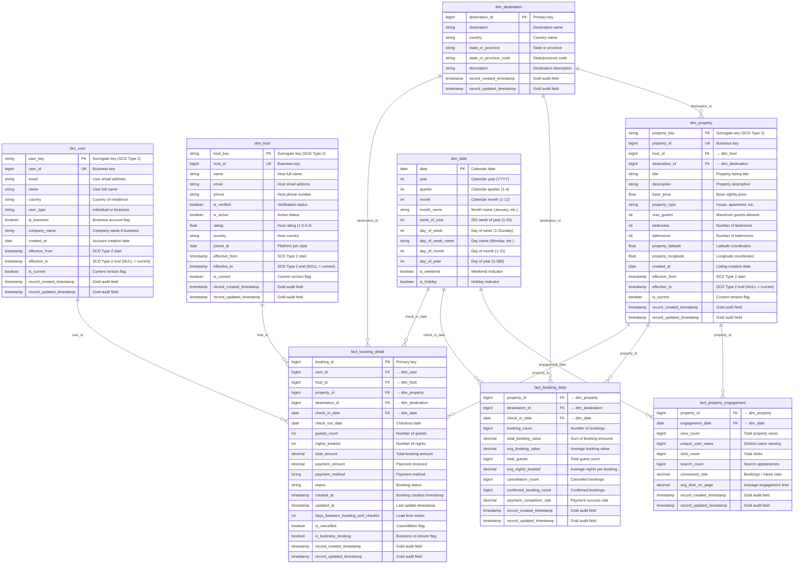

# Wanderbricks Gold Layer - Entity Relationship Diagram

## Complete Dimensional Model

This ERD shows the complete Wanderbricks Gold layer dimensional model with all dimensions, facts, and relationships.



## Relationship Summary

### One-to-Many Relationships

| Parent (One) | Child (Many) | Foreign Key | Cardinality |
|---|---|---|---|
| dim_user | fact_booking_detail | user_id | 1:N |
| dim_host | fact_booking_detail | host_id | 1:N |
| dim_host | dim_property | host_id | 1:N |
| dim_property | fact_booking_detail | property_id | 1:N |
| dim_property | fact_booking_daily | property_id | 1:N |
| dim_property | fact_property_engagement | property_id | 1:N |
| dim_destination | fact_booking_detail | destination_id | 1:N |
| dim_destination | fact_booking_daily | destination_id | 1:N |
| dim_destination | dim_property | destination_id | 1:N |
| dim_date | fact_booking_detail | check_in_date | 1:N |
| dim_date | fact_booking_daily | check_in_date | 1:N |
| dim_date | fact_property_engagement | engagement_date | 1:N |

### Key Observations

1. **dim_property is central** - Referenced by all three fact tables
2. **dim_date enables time-based analysis** - All facts have date FK
3. **dim_destination appears twice** - Both in facts and as property attribute
4. **Type 2 dimensions use surrogate keys** - But facts reference business keys
5. **fact_booking_daily is derived** - Can be computed from fact_booking_detail

## Grain Validation

### fact_booking_detail
- **Primary Key:** booking_id
- **Grain:** One row per individual booking transaction
- **Uniqueness:** Each booking_id appears exactly once

### fact_booking_daily
- **Composite Primary Key:** (property_id, check_in_date)
- **Grain:** One row per property per check-in date
- **Uniqueness:** Each property-date combination appears exactly once

### fact_property_engagement
- **Composite Primary Key:** (property_id, engagement_date)
- **Grain:** One row per property per engagement date
- **Uniqueness:** Each property-date combination appears exactly once

## Design Notes

### SCD Type 2 Implementation

**Surrogate Keys (for facts):**
- dim_user.user_key (MD5 hash of user_id + effective_from)
- dim_host.host_key (MD5 hash of host_id + effective_from)
- dim_property.property_key (MD5 hash of property_id + effective_from)

**Business Keys (for facts):**
- Facts reference business keys (user_id, host_id, property_id)
- Simplifies queries: no need to join on surrogate keys
- Point-in-time joins use is_current flag or effective_from/to

### Degenerate Dimensions

Some attributes stored directly in facts (not separate dimensions):
- **status** (in fact_booking_detail) - Booking status changes frequently
- **payment_method** (in fact_booking_detail) - Low cardinality, not analyzed independently

### Derived Metrics

Pre-calculated in fact tables for performance:
- **nights_booked** = DATEDIFF(check_out_date, check_in_date)
- **days_between_booking_and_checkin** = DATEDIFF(check_in_date, created_at)
- **conversion_rate** = bookings / views * 100

## Query Patterns

### Revenue by Destination
```sql
SELECT 
  d.destination,
  d.country,
  SUM(f.total_booking_value) as total_revenue,
  SUM(f.booking_count) as total_bookings
FROM fact_booking_daily f
JOIN dim_destination d ON f.destination_id = d.destination_id
JOIN dim_date dt ON f.check_in_date = dt.date
WHERE dt.year = 2024
GROUP BY d.destination, d.country
ORDER BY total_revenue DESC;
```

### Host Performance
```sql
SELECT 
  h.name as host_name,
  h.rating,
  h.is_verified,
  COUNT(DISTINCT f.booking_id) as total_bookings,
  SUM(f.total_amount) as total_revenue
FROM fact_booking_detail f
JOIN dim_host h ON f.host_id = h.host_id AND h.is_current = true
GROUP BY h.name, h.rating, h.is_verified
ORDER BY total_revenue DESC;
```

### Property Engagement Funnel
```sql
SELECT 
  p.title as property_title,
  SUM(e.view_count) as total_views,
  SUM(e.click_count) as total_clicks,
  COUNT(DISTINCT b.booking_id) as total_bookings,
  (COUNT(DISTINCT b.booking_id) / NULLIF(SUM(e.view_count), 0)) * 100 as view_to_booking_rate
FROM fact_property_engagement e
JOIN dim_property p ON e.property_id = p.property_id AND p.is_current = true
LEFT JOIN fact_booking_detail b ON e.property_id = b.property_id
GROUP BY p.title
ORDER BY total_views DESC;
```

